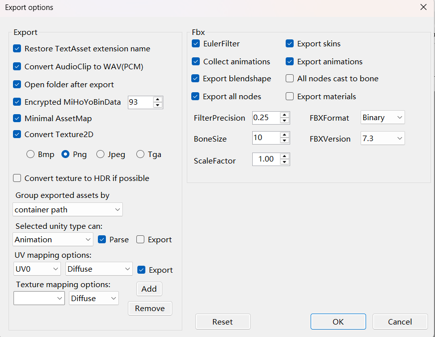
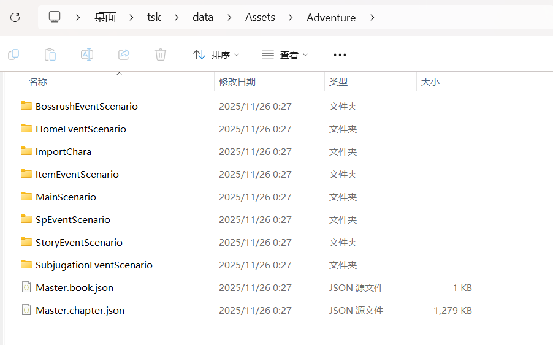
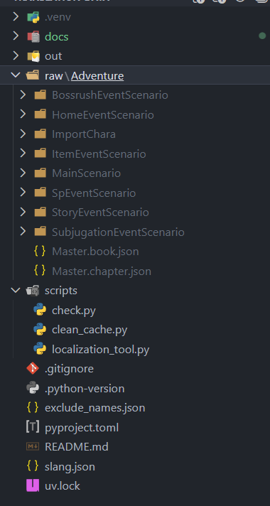
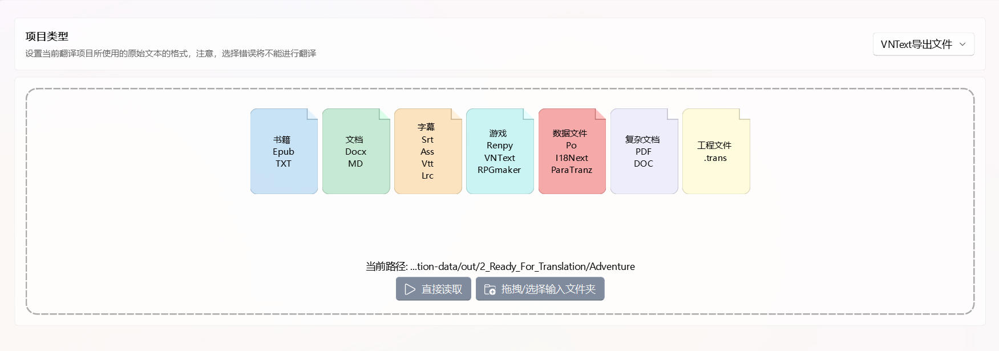

# 贡献指南与环境搭建

首先感谢看到这里的、敢于折腾的各位。
阅读完本教程，你不光可以为本项目贡献翻译，还可以学会如何获取游戏的脚本、立绘以及技能动画。

## 一、环境准备

为本项目做出贡献，需要一定的计算机基础知识。
你需要本地安装 Git 和 Python。

### 1. 下载 llama.cpp
前往 [llama.cpp Releases](https://github.com/ggml-org/llama.cpp/releases) 下载最新版本。
**注意**：请根据你的显卡和操作系统选择对应的版本：
*   **NVIDIA 显卡**: 下载带 `cuda` 字样的版本。
*   **AMD 显卡**: 下载带 `hip-radeon` 字样的版本（例如 `llama-bin-win-hip-radeon-x64.zip`）。

解压到你存储软件的目录，最终路径类似 `D:\Program\llama\llama-cli.exe`。
建议在此目录下新建一个 `models` 文件夹用于存放模型文件。

前往 [Sakura-GalTransl-14B-v3.8](https://huggingface.co/SakuraLLM/Sakura-GalTransl-14B-v3.8) 下载量化模型。请根据你的显存大小选择合适的量化版本（如 `Q4_K_M` 或 `Q5_K_M`）。

### 2. 下载 AiNiee
这是一个方便的用于 AI 翻译的辅助软件。
前往 [AiNiee](https://github.com/NEKOparapa/AiNiee) 下载，并像 llama 一样解压到你常用的路径。

### 3. 下载 Python
前往 [Python 官网](https://www.python.org/downloads/) 下载 Python。
安装时请务必勾选 **"Add Python to PATH"**（添加到环境变量）。

安装成功后，在终端运行以下命令检查：
```bash
python -V
# 输出示例: Python 3.14
```

然后安装 `uv` 包管理工具（可选，但推荐）：
```bash
pip install uv
```

### 4. 下载 Git
前往 [Git 官网](https://git-scm.com/install/windows) 下载并安装。

### 5. 下载 AnimeStudio
下载 [AnimeStudio](https://github.com/Escartem/AnimeStudio) 用于解包游戏资源。

## 二、获取数据

### 1. 克隆项目
环境搭建好后，首先需要获取本项目代码。
如果你打算贡献翻译，**强烈建议先在 GitHub 上 Fork 本项目**，然后克隆你自己的仓库。

```bash
# 请将下面的链接换成你 Fork 后的仓库地址
git clone https://github.com/你的用户名/translation-data.git
cd translation-data
```

### 2. 清理旧缓存
确保你已经安装并运行过游戏，且游戏数据是最新版本。
运行以下命令清理过期数据：

```bash
uv run scripts/clean_cache.py
```

**注意**：在运行前，你需要修改脚本 `scripts/clean_cache.py` 中的路径配置：

```python
# ================= 配置区域 =================

# 请将 <你的用户名> 替换为你 Windows 的实际用户名
CACHE_PATH = "C:/Users/<你的用户名>/AppData/LocalLow/Unity/FANZAGAMES_twinkle_starknightsX"

# 【安全开关】
# True = 模拟运行（只列出会被删除的文件，不执行删除）
# False = 实际运行（真的会删除文件，请谨慎！）
DRY_RUN = False

# ===========================================
```
如果不清理旧缓存，解包时可能不会显示新的数据。

### 3. 解包资源
1.  打开 `AnimeStudio.GUI.exe`。
2.  点击菜单栏 `File -> Load folder`。
3.  选择路径：`C:\Users\<你的用户名>\AppData\LocalLow\Unity\FANZAGAMES_twinkle_starknightsX`。
    *   *提示：如果找不到 `AppData`，请在文件夹选项中开启“显示隐藏文件”。*
    *   *提示：如果提示内存不足，选择“是”继续即可。*
4.  在 `Asset List` 选项卡中看到资源列表后，设置筛选器 `Filter Type` 为 `MonoBehaviour`。
5.  点击 `Options -> Export options`，将 **Group exported assets by** 修改为 **Container Path**，如下图所示：
    
6.  在搜索框输入 `Adventure` 并回车。
7.  点击 `Export -> Filtered assets`，选择一个临时目录导出。
    你将得到如图所示的文件结构：
    

## 三、处理数据

### 1. 整理文件
将导出的文件放入本项目的 `raw` 目录中，最终目录结构应如下所示：


### 2. 提取脚本
可以先清空 `out` 目录下的 `1_For_Translation` 和 `2_Ready_For_Translation` 子目录（如果有）。

运行提取命令：
```bash
uv run scripts/localization_tool.py extract "raw"
```

输出示例：
```text
--- 阶段一：开始提取 ---
成功提取 1303 个角色...
已加载 x 个排除项...
找到已存在的 'out/names.json'...
--- 提取完成 ---
文件已输出到 'out/1_For_Translation' 目录。
```
*   **注意**：如果 `names.json` 出现了新的角色名，请翻译并更新 `slang.json`。

### 3. 映射与预处理
运行映射命令：
```bash
uv run scripts/localization_tool.py map
```

输出示例：
```text
--- 阶段二：开始映射与预处理 ---
已加载 1303 个角色映射。
文件已输出到 'out/2_Ready_For_Translation' 目录。
```

## 四、翻译

### 1. 启动本地大模型
在 llama 安装目录启动终端，运行翻译接口：

```bash
# 请根据你的显卡显存调整 -c (上下文长度) 和 -ngl (GPU层数)
llama-server -m models/Sakura-Galtransl-14B-v3.8-Q5_K_S.gguf -c 8192 -np 4 -fa on -ngl 999 -a Sakura-Galtransl-14B-v3.8 --port 6006
```

### 2. 配置 AiNiee
1.  启动 `AiNiee`。
2.  在 **接口管理** 中配置 SakuraLLM 的接口地址（如 `http://127.0.0.1:6006`）和模型名称。点击测试确保接口连通。
3.  将 `SakuraLLM` 拖动到下方的 `翻译接口` 栏启用。
4.  在 **任务设置** 中，设置 **并发任务数**（建议与上面 llama 参数 `-np` 保持一致）。
5.  前往 **术语表**，导入本项目中的 `slang.json` 文件。
6.  加载目录选择 `out/2_Ready_For_Translation`，开始翻译。
    

### 3. 完成翻译
翻译完成后，AiNiee 会输出 JSON 文件。请将这些文件（保持原有的目录结构）放入 `out/3_Translated` 目录。

### 4. 检查格式
运行检查脚本，修复 AI 可能导致的格式错误：
```bash
uv run scripts/check.py
```
*   **常见错误**：AI 有时会漏翻标题或搞错格式。必须确保格式为 `第x话,标题,B (或P)`，否则游戏无法加载脚本。脚本报错时请手动修正对应的 JSON 文件。

## 五、提交 (Contribute)

如果你完成了翻译并通过了检查，欢迎提交代码！

### 1. 检查状态
查看当前修改了哪些文件，确保只包含 `out/3_Translated` 下的 JSON 文件或 `slang.json`。
```bash
git status
```

### 2. 创建分支
建议为你的本次翻译创建一个新分支，避免冲突。
```bash
# 例如：git checkout -b translate-chapter-5
git checkout -b <分支名称>
```

### 3. 提交更改
将翻译好的文件添加到暂存区并提交。
**注意**：请勿提交 `raw`、`out/1_...` 或 `out/2_...` 目录下的文件。

```bash
# 添加翻译文件
git add out/3_Translated/
# 如果你更新了术语表
git add slang.json

# 提交并附带说明
git commit -m "feat: 更新第X章翻译"
```

### 4. 推送与合并
将分支推送到你 Fork 的远程仓库：
```bash
git push origin <分支名称>
```

最后，前往 GitHub 你的仓库页面，点击 **"Compare & pull request"** 发起合并请求 (PR)。没问题的话我会尽快合并，感谢你的贡献！